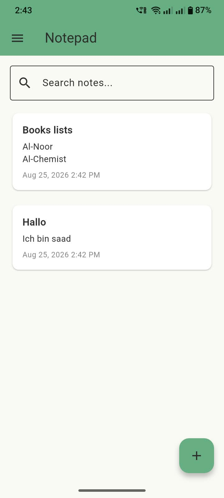
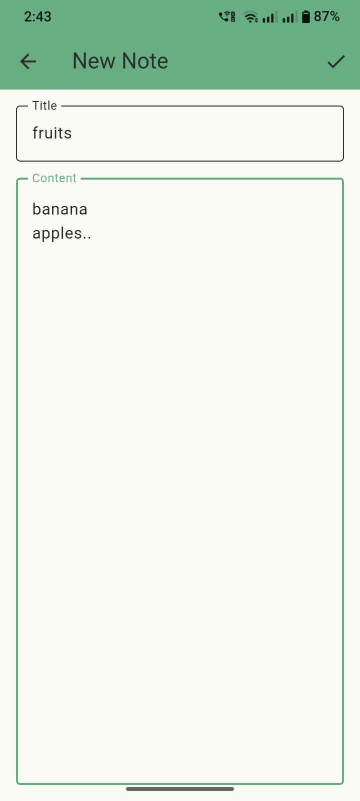
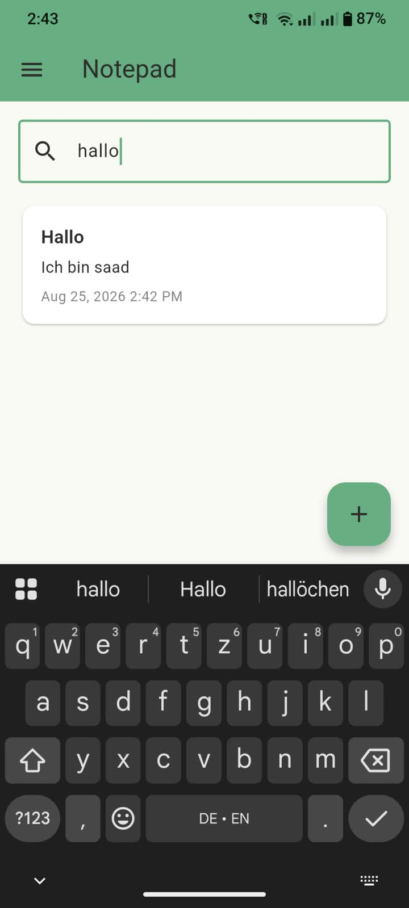
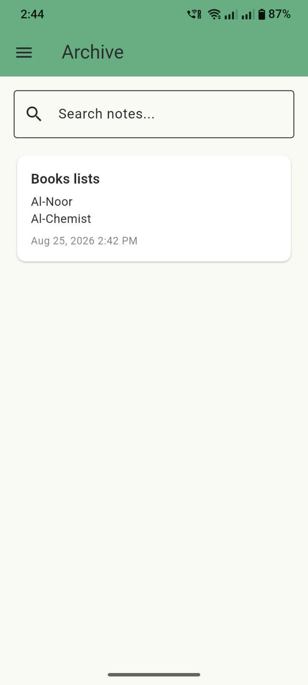
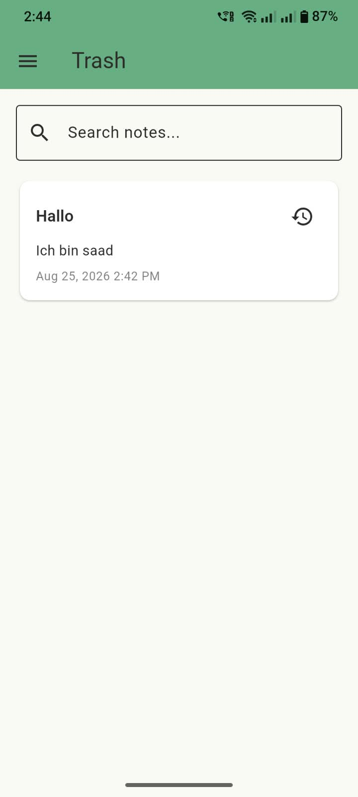

# Notepad

A simple cross-platform notes app built with Flutter, BLoC, and SQLite.

## Features
- Add, edit, and search notes
- Soft delete with restore, and permanent delete from Trash
- Archive and unarchive notes
- Runs on Android, iOS, web, and desktop

## Tech Stack
- Flutter / Dart
- flutter_bloc (state management)
- sqflite (local storage)

## How It Works
Notes are stored locally in an SQLite database through a single `NotesDatabase` helper. A `NotesBloc` manages all note actions (add, delete, restore, archive, search), while the drawer switches between Active, Archived, and Trash views.

## Screenshots
| Notes List | New Note | Search |
|---|---|---|
|  |  |  |

| Archive | Trash |
|---|---|
|  |  |

## Setup
1. Clone the repo
2. Run `flutter pub get`
3. Run `flutter run`
